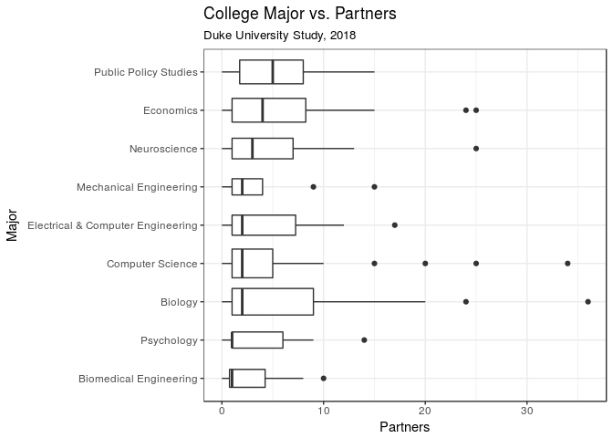
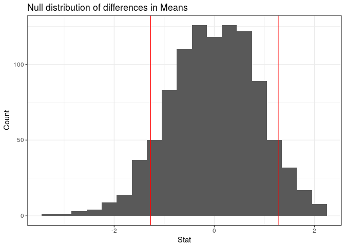
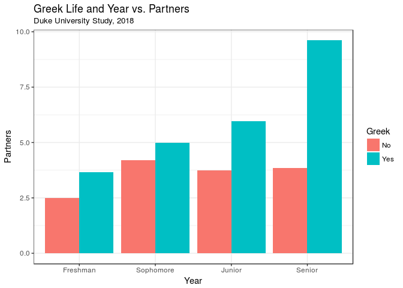
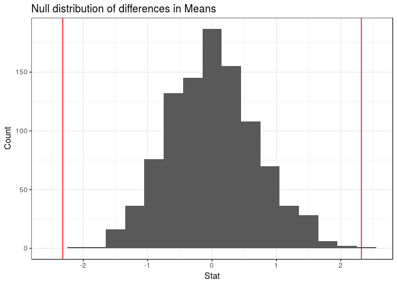

Let's Talk About Sex
================
Max Bartlett, Jennifer Chin, and Liam Pulsifer
05 May, 2018

Introduction
------------

### Description of Data

For our final project, we wanted to analyze the number of sexual partners that college students, primarily those at Duke, have had and whether or not that number correlates to a range of demographic factors, such as religion, year in school, or political views. We collected our own data for this project using a Qualtrics survey. This survey was relatively short and had 14 questions. The results of these questions are stored in the variables below:

1.  `student`: Are you a college student?
2.  `college`: Which college do you go to?
3.  `year`: Which year in college are you?
4.  `age`: What is your age?
5.  `gender`: What is your gender?
6.  `major*`: What is your major?
7.  `athlete`: Are you a student athlete?
8.  `greek`: Are you involved in a fraternity or sorority?
9.  `politics`: How would you describe your political views? (There were 5 response options for this question: Very Conservative, Somewhat Conservative, Neither, Somewhat Liberal, and Very Liberal)
10. `religious`: Would you consider yourself to be religious?
11. `religion`: If so, which religion do you practice?
12. `partners`: In your life, how many sexual partners have you had?
13. `partners_college`: Since coming to college, how many sexual partners have you had?
14. `relationship`: Are you currently in a committed romantic relationship that has lasted longer than 1 month?

`*` split into two variables for analysis

To get answers to our survey, we posted the survey in the All Duke Facebook group and the class Slack channel. We received 394 submissions in less than 2 days. After poring over the responses, we removed ones with no answers filled in and ones that were evidently bogus, and were left with 361 observations. Additionally, we split the `major` column into `major_one` and `major_two` to account for people who listed two majors.

Research Question
-----------------

Our research question is "Which demographic factors are most strongly associated with number of sexual partners in college students?" To answer this question using the data we collected (described above), we first needed to clean the data and remove some unnecessary variables and observations.

We chose to filter the data for students at Duke because we didn't get enough responses from non-Duke students (fewer than 10) to do any meaningful analysis. We also chose to remove some variables, such as ip\_address from which the survey was taken, which we deemed extraneous to our research question.

### Summary Statistics

The following tibble lists the summary statistics for the total number of partners and the number of partners since coming to college from the responses in our dataset.

    ## # A tibble: 1 x 8
    ##     max   min  mean median    sd    q1    q3   num
    ##   <dbl> <dbl> <dbl>  <int> <dbl> <dbl> <dbl> <int>
    ## 1   36.    0.  4.41      2  5.81    1.  5.50   319

    ## # A tibble: 1 x 8
    ##     max   min  mean median    sd    q1    q3   num
    ##   <dbl> <dbl> <dbl>  <int> <dbl> <dbl> <dbl> <int>
    ## 1   25.    0.  3.22      2  4.53    1.    4.   317

The mean number of total partners is greater than the mean number of partners since coming to college, yet the median number of partners stays the same, at two. This is an interesting observation, as we expected the median to increase as well. This may indicate that those who are already having sex continue to have new partners in college, and those who didn't have sex in high school are continuing to abstain from sex.

#### Sexual Activity Groupings

To investigate this, we split students into four groups based on whether or not they were sexually active in high school and whether or not they were sexually active in college: `Not sexually active in high school and in college`, `Sexually active in high school and not sexually active in college`, `Sexually active in high school and college`, and `Not sexually active in high school and sexually active in college`.

    ## # A tibble: 3 x 2
    ##   partner_group                                                         n
    ##   <chr>                                                             <int>
    ## 1 Not sexually active in high school and college                       59
    ## 2 Sexually active in high school and college                          239
    ## 3 Sexually active in high school and not sexually active in college    19

There is a surprising result here: not a single person who wasn't sexually active in high school is sexually active in college. Since we expect that many people who abstain from sex do so for religious reasons, we want to know if this an accurate assumption within our data.

#### Religion and Abstinence

    ## # A tibble: 2 x 2
    ##   religious     n
    ##   <chr>     <int>
    ## 1 No           36
    ## 2 Yes          22

Just over 1/3 of those who declared themselves as Abstinent reported being religious. Therefore, the majority of non-religious abstinent people are remaining abstinent for other reasons.

### College Major vs. Sexual Partners

Next, we wanted to see if choice of major and number of sexual partners are at all correlated. We displayed the summary statistics for majors with more than 10 respondents, arranged by mean number of partners, and plotted the results below on a box and whisker plot.

    ## # A tibble: 9 x 9
    ##   major_one                 max   min  mean median    sd    q1    q3   num
    ##   <chr>                   <dbl> <dbl> <dbl>  <dbl> <dbl> <dbl> <dbl> <int>
    ## 1 Economics                 25.    0.  5.93     4.  6.45 1.00   8.25    28
    ## 2 Biology                   36.    0.  5.91     2.  8.28 1.00   9.00    35
    ## 3 Public Policy Studies     15.    0.  5.25     5.  4.23 1.75   8.00    28
    ## 4 Neuroscience              25.    0.  4.95     3.  6.23 1.00   7.00    21
    ## 5 Computer Science          34.    0.  4.46     2.  7.10 1.00   5.00    41
    ## 6 Electrical & Computer …   17.    0.  4.35     2.  4.97 1.00   7.25    20
    ## 7 Psychology                14.    0.  3.46     1.  4.41 1.00   6.00    13
    ## 8 Mechanical Engineering    15.    0.  3.38     2.  4.17 1.00   4.00    13
    ## 9 Biomedical Engineering    10.    0.  2.81     1.  3.10 0.750  4.25    16

Economics and Biology topped the list with a mean of nearly six partners, while Public Policy Studies had the largest median with five partners. Biology and Computer Science had the most extreme upper outliers, with each major containing one observation of more than 30 sexual partners. There were no lower outliers because each major's lower whisker included 0 (the lowest possible value). One observation we instantly made is the stark contrast between Pratt and Trinity students. Does the stereotype that engineering majors have fewer sexual partners than other students hold true?

#### Trinity & Pratt vs. Sexual Partners

We first categorized respondents into either Trinity or Pratt based on their major, then displayed the summary statistics for number of partners.

    ## # A tibble: 2 x 9
    ##   school    max   min  mean median    sd    q1    q3   num
    ##   <chr>   <dbl> <dbl> <dbl>  <dbl> <dbl> <dbl> <dbl> <int>
    ## 1 Pratt     17.    0.  3.55     2.  4.05    1.  4.50    55
    ## 2 Trinity   36.    0.  4.82     2.  6.27    1.  6.00   244

It appears that the mean number of sexual partners for Trinity students is 4.82, higher than the mean number of sexual partners for Pratt students, at 3.55. But is this difference statistically significant? We performed a hypothesis test to find the answer.

Our null hypothesis was that there was no difference between the means of the two groups, while our alternative hypothesis was that there was such a difference.

    ## # A tibble: 1 x 1
    ##   p_value
    ##     <dbl>
    ## 1   0.132

The histogram shows our simulated null distribution, with red lines marking our observed difference and negative one times that observed difference.

Since the p value is greater than our significance level of .05, we can conclude that there is not enough evidence to determine that our observed difference was not a result of chance, so we fail to reject the null hypothesis. This steretype doesn't seem to hold true, at least in our sample.

### Greek Life & Year in School vs. Sexual Partners

We also wanted to see if the stereotypes surrounding Greek life and sexual promiscuity were true for our dataset. After experimenting with our shiny app and grouping and coloring a bar graph with a broad mixture of categorial variables, we found that the bar graph grouped by year in school and colored by greek life was particularly interesting. Below we have calculated the summary statistics on our dataset based on year in school, and reproduced the graph of interest.

    ## # A tibble: 4 x 9
    ##   year        max   min  mean median    sd    q1    q3   num
    ##   <chr>     <dbl> <dbl> <dbl>  <dbl> <dbl> <dbl> <dbl> <int>
    ## 1 Freshman    24.    0.  2.78     1.  4.35    0.  3.25    68
    ## 2 Sophomore   34.    0.  4.47     2.  5.74    1.  5.00   118
    ## 3 Junior      24.    0.  4.55     2.  4.87    1.  6.00    66
    ## 4 Senior      36.    0.  5.92     3.  7.66    1.  8.00    64

As seen in the summary statistics and the graph, the number of sexual partners, both mean and median, increases as year in school progresses (Seniors, on average, have had more sexual partners that freshmen, on average). This rather linear trend is what we expected to see in this graph; as people get older, they have had more sexual partners. This trend is extremely evident for Duke students who participate in Greek life. The average number of sexual partners greatly increases for students in Greek life throughout their 4 years in college, while the increase in average number of sexual partners for students who aren't in Greek life is much smaller. This results in a large gap in the overall mean numbers of sexual partners for students in Greek organizations and students who are not.

To see whether this difference in number of sexual partners between students in Greek life and students not in Greek life is a significant one, we can again conduct a hypothesis test. Our null hypothesis is that there is no difference between the mean number of sexual partners for students in Greek organizations and students who are not. Our alternative hypothesis is that there is such a difference. To investigate this hypothesis, we can generate a null distribution, and then examine the p-value of seeing a result equally or more extreme than our observed result given that generated null distribution.

    ## # A tibble: 1 x 1
    ##   p_value
    ##     <dbl>
<<<<<<< HEAD
    ## 1      0.
=======
    ## 1       0
>>>>>>> 904204ed9823468acd921b5c71e81929067ad557

The red lines on the null distribution visualized in a histogram above represent the observed difference in means between the two groups and negative one times that difference, showing which data are equally or more extreme than our observed results.

The p-value is 0, which gives us enough evidence to reject the null hypothesis and say that there is in fact a difference in the mean number of sexual partners between students who are in fraternities and sororities and students who are not.

### Linear Model

After looking at these different factors and considering which have real correlations with numbers of sexual partners, a natural place to go next was to try to create a linear model which would predict number of sexual partners based on a number of factors.

We created two linear models, one using forward- and one using backward-selection for adjusted R^2 value. The backward-selection model modelled `partners` using the variables `religion`, `year`, `age`, `gender`, `athlete`, `greek`, `politics`, and `relationship`. The forward-selection model, which is shown below, modelled `partners` using the variables `religion`, `greek`, `athlete`, and `politics`, and its adjusted R^2 value was the higher of the two, at `0.2147764`, compared to the `0.1728393` of the backwards-selection model.

    ## 
    ## Call:
    ## lm(formula = partners ~ religion + greek + athlete + politics, 
    ##     data = sex_survey)
    ## 
    ## Coefficients:
    ##                           (Intercept)  
    ##                                8.3296  
    ##                  religionChristianity  
    ##                               -7.6823  
    ##     religionChristianity and Buddhism  
    ##                               -8.3296  
    ##                      religionHinduism  
    ##                               -9.4628  
    ##                         religionIslam  
    ##                               -5.8311  
    ##                       religionJudaism  
    ##                               -5.4114  
    ##                         religionOther  
    ##                                2.4605  
    ##                              greekYes  
    ##                                3.4255  
    ##                            athleteYes  
    ##                                3.6021  
    ##      politicsNeither,Somewhat Liberal  
    ##                               -0.6473  
    ##         politicsSomewhat Conservative  
    ##                                3.0588  
    ##              politicsSomewhat Liberal  
    ##                                0.6704  
    ## politicsSomewhat Liberal,Very Liberal  
    ##                                5.9272  
    ##             politicsVery Conservative  
    ##                               -1.1225  
    ##                  politicsVery Liberal  
    ##                                1.2099

###### Forwards-selection model adjusted R^2

    ## [1] 0.2147764

###### Backwards-selection model adjusted R^2

    ## [1] 0.1728393

This model is an interesting one. It includes `religion` and `politics`, two variables which in American conversation are usually seen as factors in people's sexual practices (religions having tenets condoning certain practices, and different political groups having different beliefs on social issues like sexual activity). It also includes two variables in the Duke community which are seen as factors in a person's level of sexual activity, `greek` and `athlete`, with both groups being stereotyped as having higher levels of sexual activity. Interestingly enough, however, it doesn't include `year` or `age`, indicating that perhaps people aren't having sex with a significant number of people throughout their college years. The model also doesn't include the `relationship` variable or the `major_one` variable, though that is perhaps unsurprising.

Interpreting this model, we can see that the intercept is 8.3296, which means that this model predicts that a person who answered the responses corresponding to all of the baseline levels of this model would have 8.3296 lifetime sexual partners. The coefficients indicate the expected difference in number of sexual partners for respondents who answered that way. For example, the coefficient for "religionHinduism" is -9.4628, which means that this model predicts respondents who are Hindu to have had, on average, 9.4628 *fewer* sexual partners. These coefficients show some interesting patterns, such as "Yes" responses to the *Greek* and *Athlete* variables indicating more predicted sexual partners.

It is important, however, to take this model with a grain of salt because the adjusted R^2 is only `0.2147764`, which is rather small to make any judgements with.

Conclusion
----------

### Summary

Overall, this dataset was very interesting for our group to work with and we discovered some intriguing relationships between the average number of sexual partners of Duke students and different demographic variables. We also enjoyed comparing our findings to typical stereotypes regarding sexual promiscuity and people of a certain demographic. Our shiny app allows us to analyze a variable number of relationships with ease by combining different categorical variables and seeing the resulting graph.

After running some initial summary statistics on average total number of sexual partners and average number of sexual partners since coming to college, we found that the mean was higher for total sexual partners while the median remained the same. This was an interesting observation, as it shows that people's sexual habits may remain the same throughout high school and college more often than is typically believed.

These initial summary statistics prompted us to group our dataset into 4 categories: Not sexually active in high school and college, Sexually active in high school and not sexually active in college, Sexually active in high school and college, Not sexually active in high school and sexually active in college. Perhaps the most shocking discovery throughout the entire project was finding that that there were zero observations of people who were not sexually active in high school, but sexually active in college. This caused us to wonder if perhaps this decision to remain abstinent was the result of religious views, so we decided to see how many of the people who weren't sexually active in high school or college were religious. About 1/3 of this group reported being religious.

Next, we wanted to analyze the relationship between college major and number of sexual partners. We ran summary statistics on majors with more than 10 observations, and found that, on average, Economics and Biology majors are the most sexually active. After running these summary statistics and plotting box and whisker plots, it was evident that there was a difference (in our dataset) between the mean number of sexual partners of Trinity majors and of Pratt majors. To investigate this observed difference further, we grouped our dataset based on which school the observed major was in: Trinity or Pratt. After running summary statistics on this variable, our data showed that the mean number of sexual partners was higher for Trinity students but that the median was the same for Trinity and Pratt students. In order to determine if this difference was statistically significant, we ran an independence test and found that the p value was greater than our significance level of 0.05, so the results were not statistically significant.

We also wanted to look at the relationship between greek life participation, year in school, and number of sexual partners. We found that the number of sexual partners increases as year in school progresses, which is something we would expect. We also found that this is particularly true for students who participate in greek life. To see if this finding was statistically significant, we ran a hypothesis test on the difference between mean number of sexual partners for those involved in greek life and those not involved in greek life. This hypothesis test produced a p-value of zero, which suggests that this difference is meaningful and that the stereotypes surrounding greek life and sexual promiscuity may have some validity to them.

Finally, we decided to create a linear model to fully address our research question and determine which demographic factors had the strongest relationship with number of sexual partners. We created two linear models using forward and backward selection with the adjusted R-squared value. The forward selection model included religion, greek, athlete, and politics as influential variables and had an adjusted R-squared value of 0.2147764, which was higher than the backward selection model with 0.1728393. This model is rather interesting as it includes variables we would expect to be in the model, but it leaves out variables such as age that people would typically expect to be positively correlated with number of sexual partners.

In conclusion, we found that *religion*, *greek*, *athlete*, and *politics* were the demographic factors that were most strongly associated with number of sexual partners. Of course, other demographic variables could definitely be influential and these demographic variables may not be the most influential overall, but this is what we were able to conclude with the tests we ran. We could not confirm some stereotypes regarding sexual activity, while we did find evidence supporting others. This project definitely gives way to further statistical research in the area.

### Critiques

Because our survey was voluntary and taken primarily by Duke students and people we know, we are aware that our data may be skewed and not necessarily very representative of the Duke population, or of students as a whole. For example, because we are sophomores, we got significantly more responses from sophomores as opposed to people from other years. Our data is also subject to voluntary response bias. We only shared the survey on Facebook, so our sample is only representative of Duke students on Facebook who were interested in sharing details of their personal lives. The sample is not representative of people who don't check Facebook often, or people who might have been uncomfortable with the survey's subject matter at first glance.

As far as the content of our survey, we could have been more specific and thorough in our questioning. One of the most glaring omissions was of the lack of a definition for "sexual partner." This definition varies between people, and may have influenced people's individual responses. Additionally, there may be other confounding variables that we didn't ask for in the survey. For example, data on sexual orientation would've been useful for our analysis. We also could've included additional numerical variables, for instance, a rating of how sexually active people thought they were compared to the rest of the Duke community (1 being less sexually active than nearly all Duke students, 10 being more sexually active than nearly all Duke students, and 5 being in the middle) in order to gauge Duke students' views on sex and dating at Duke, compared to their actual behavior. Adding more numerical variables would have allowed us to use a wider variety of statistical techniques. Further, we didn't include any questions about objective frequency of sexual activity, only number of sexual partners, which led to our missing out on several different angles of questioning.

Something that wasn't really a limitation, but that we had to consider, was the sensitivity of our subject matter. We are aware that the content of our survey is rather personal. Although our survey was intended to be entirely anonymous, due to the relatively small size of our dataset (around 350 observations), we recognize that it is potentially possible for an observer to identify a person based on his or her responses to our survey. For this reason, we made sure that multiple visualizations did not show the same data points displayed with different demographic information. We did not want the people reading our project to be able to combine information from multiple visualizations and further determine who the responses belonged to based on that information.
