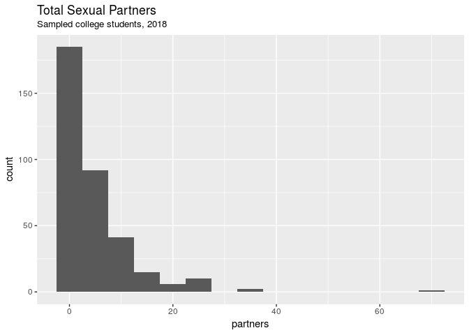
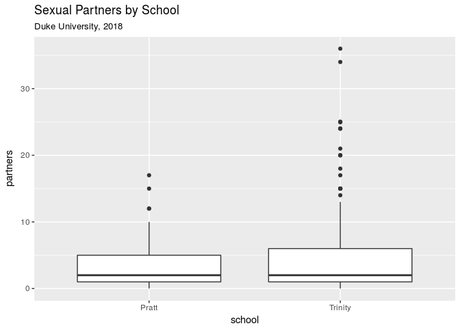

Student Sex Lives
================
Team POWER
3/28/18

Section 1. Introduction
-----------------------

For our final project, we wanted to analyze the number of sexual partners college students, primarily those at Duke, have had and whether or not that number correlates to a range of demographic factors, such as religion, year in school, or political views. We collected our own data for this project using a Qualtrics survey. This survey was relatively short and had 14 questions, and the results of these questions are stored in the variables below:

1.  *student*: Are you a college student?
2.  *college*: Which college do you go to?
3.  *year*: Which year in college are you?
4.  *age*: What is your age?
5.  *gender*: What is your gender?
6.  *major*: What is your major?
7.  *athlete*: Are you a student athlete?
8.  *greek*: Are you involved in a fraternity or sorority?
9.  *politics*: How would you describe your political views? (There were 5 options for this question: Very Conservative, Somewhat Conservative, Neither, Somewhat Liberal, and Very Liberal)
10. *religious*: Would you consider yourself to be religious?
11. *religion*: If so, which religion do you practice?
12. *partners*: In your life, how many sexual partners have you had?
13. *partners\_college*: Since coming to college, how many sexual partners have you had?
14. *relationship*: Are you currently in a committed romantic relationship that has lasted longer than 1 month?

To get answers to our survey, we asked our friends to fill it out and also posted the survey in the All Duke Facebook group and the class Slack channel. We received 394 responses to our survey in less than 2 days. Because our survey was voluntary and taken primarily by Duke students and people we know, we are aware that our data may be skewed and not necessarily completely representative. In other words, our data is definitely subject to voluntary response bias. We are also aware that, by the nature of the questions asked in our survey, we may have gotten some bogus responses (which we plan to identify and remove from our complete analysis). However, we hope to still be able to find some interesting trends within our data, and to find a relationship(s) between the number of sexual partners for college students and another one of our variables.

Section 2. Data analysis plan
-----------------------------

#### Variables

Dependent Variables:

*partners*, *partners\_college*

An example visualization including these variables is below.



    ## # A tibble: 1 x 4
    ##   mean_partners median_partners min_partners max_partners
    ##           <dbl>           <dbl>        <dbl>        <dbl>
    ## 1          4.78            2.00            0         69.0

After removing non-numeric answers and filtering for data within a reasonable range, the data seem to be heavily skewed right. There are some outliers, the largest being 69 (it's safe to say this answer can be thrown out along with other joke responses such as "6969", "420", etc.). But in general, the partner data seem to be within our expectations.

Independent Variables:

*student*, *college*, *year*, *age*, *gender*, *major*, *athlete*, *greek*, *politics*, *religious*, *religion*, *relationship*

An example visualization incorporating these variables is below.

    ## # A tibble: 5 x 3
    ## # Groups:   greek [?]
    ##   greek gender median
    ##   <chr> <chr>   <dbl>
    ## 1 No    Female   2.00
    ## 2 No    Male     2.00
    ## 3 No    Other    0   
    ## 4 Yes   Female   3.00
    ## 5 Yes   Male     6.00



#### Comparison Groups

Some examples of groups we might use for comparisons could be different major categories, or even subsets of those such as those of certain genders in different major categories. However, we plan on performing these comparisons between as many of these different groups as possible, so we don't have any specific comparison groups in mind.

#### Statistical Methods

Some methods that we believe will be useful are the following.

-   Bootstrapping: Using bootstrapping, we'll be able to create confidence intervals for the population mean number of sexual partners for a variety of different groups based on the independent variables.
-   Hypothesis Tests: These will allow us to test questions such as "Is there a statistically significant difference between the median number of sexual partners in biomedical engineers vs. computer scientists?" or any number of questions comparing the response variables among dependent variable groupings.
-   Linear modeling: By creating a linear model, we can see which collection of these variables creates the best prediction of number of sexual partners.

#### Desired Results

At this point, we're simply addressing the question of whether there exists a relationship between some of these variables (any number of them) and the number of sexual partners a student has had in their life. To support the existence of such a relationship, we would expect to see a linear model examining this relationship to have a high R^2 value, a hypothesis test to report a statistically significant p-value, or a set of confidence intervals to show meaningful differences.

Section 3. Data
---------------

``` r
glimpse(data)
```

    ## Observations: 394
    ## Variables: 18
    ## $ ip_address         <chr> "174.193.140.119", "152.3.43.21", "152.3.43...
    ## $ duration           <chr> "33", "66", "56", "39", "53", "40", "39", "...
    ## $ location_latitude  <chr> "35.01210022", "35.9954071", "35.9954071", ...
    ## $ location_longitude <chr> "-80.88210297", "-78.90190125", "-78.901901...
    ## $ student            <chr> "Yes", "Yes", "Yes", "Yes", "Yes", "Yes", "...
    ## $ college            <chr> "Duke University", "Duke University", "Duke...
    ## $ year               <chr> "Sophomore", "Sophomore", "Sophomore", "Sop...
    ## $ age                <chr> "19", "19", "19", "19", "17", "20", "21", "...
    ## $ gender             <chr> "Male", "Female", "Male", "Female", "Female...
    ## $ major              <chr> "Computer Science", "Neuroscience", "Comput...
    ## $ athlete            <chr> "No", "No", "No", "No", "No", "No", "Yes", ...
    ## $ greek              <chr> NA, "No", "No", "No", "No", "Yes", "No", "N...
    ## $ politics           <chr> "Somewhat Liberal", "Somewhat Liberal", "So...
    ## $ religious          <chr> "No", "Yes", "No", "No", "Yes", "Yes", "No"...
    ## $ religion           <chr> NA, "Hinduism", NA, NA, "Christianity", "Ch...
    ## $ partners           <chr> "5", "0", "5", "0", "0", "3", "8", NA, "2",...
    ## $ partners_college   <chr> NA, "0", "2", "0", "0", "3", "2", NA, "2", ...
    ## $ relationship       <chr> "Yes", "Yes", "Yes", "No", "No", "Yes", "Ye...
